# Portfolio Monitor

Application for monitoring my schwab stock portfolio

## Project Dependencies

This project uses a small TypeScript-based serverless stack for monitoring a Schwab portfolio and sending alerts when configured thresholds are crossed.

### Runtime

- **Node.js 24**
  Runs the application locally and in AWS Lambda.

- **TypeScript 6**
  Provides static type checking and compiles the TypeScript source code to JavaScript. TypeScript 6 is used instead of TypeScript 7 for broader compatibility with the current TypeScript tooling ecosystem.

### Application Dependencies

- **AWS SDK for JavaScript v3**
  Provides clients for interacting with AWS services.

  Expected clients include:

  - `@aws-sdk/client-ssm` for reading and updating Schwab credentials and OAuth tokens in Parameter Store.
  - `@aws-sdk/client-dynamodb` and `@aws-sdk/lib-dynamodb` for storing portfolio state, high-water marks, and alert history.
  - `@aws-sdk/client-sns` for sending portfolio alerts.
  - `@aws-sdk/client-scheduler` only if schedules need to be created or modified from application code.

- **Zod**
  Validates data received from the Schwab API at runtime. TypeScript types are removed during compilation, so Zod ensures external API responses match the structure expected by the application.

### Development Dependencies

- **esbuild**
  Transpiles and bundles the TypeScript application into a deployable AWS Lambda artifact. Esbuild handles packaging, while TypeScript remains responsible for type checking.

- **AWS SAM CLI**
  Defines and deploys the Lambda function, EventBridge Scheduler schedule, DynamoDB table, SNS topic, IAM roles, and related AWS resources.

- **Vitest**
  Runs unit tests for portfolio calculations, drawdown thresholds, alert state, and Schwab API response handling.

- **ESLint**
  Detects common code-quality and correctness issues.

- **typescript-eslint**
  Allows ESLint to understand and analyze TypeScript source code.

- **Prettier**
  Applies consistent formatting across TypeScript, JSON, YAML, and Markdown files.

- **`@types/node`**
  Provides TypeScript definitions for Node.js APIs and globals.

### Build Responsibilities

The project intentionally separates type checking from deployment bundling:

```text
tsc --noEmit
    │
    └── Checks TypeScript types

esbuild
    │
    └── Transpiles and bundles the Lambda artifact
```

Esbuild does not perform full TypeScript type checking. Both steps should run before deployment.

### Suggested Installation

```bash
npm install zod \
  @aws-sdk/client-ssm \
  @aws-sdk/client-dynamodb \
  @aws-sdk/lib-dynamodb \
  @aws-sdk/client-sns
```

```bash
npm install --save-dev \
  typescript@^6 \
  @types/node \
  esbuild \
  vitest \
  eslint \
  typescript-eslint \
  prettier
```

The AWS SAM CLI is installed separately from the project dependencies:

```bash
brew install aws-sam-cli
```

Installation methods vary by operating system. Refer to the AWS SAM documentation when installing on Linux or Windows.

A typical validation and deployment workflow is:

```bash
npm run typecheck
npm run lint
npm test
npm run build
npm run deploy
```

### Dependency Guidelines

- Pin the Node.js major version in `package.json`, `.nvmrc`, or `.node-version`.
- Commit `package-lock.json` so local development, CI, and deployments use reproducible dependency versions.
- Import only the AWS SDK v3 clients required by the application.
- Do not store Schwab credentials, OAuth tokens, or AWS credentials in source code, `.env` files committed to Git, or Lambda configuration files.
- Run `npm audit` and dependency update checks regularly.

# Architecture

The application periodically retrieves Schwab account information, evaluates portfolio protection rules, and sends notifications when a configured threshold is crossed.



## Components

- **EventBridge Scheduler** invokes the portfolio monitor on a configured schedule.
- **AWS Lambda** runs the TypeScript application and evaluates portfolio rules.
- **AWS Secrets Manager** stores the Schwab application client credentials.
- **DynamoDB** stores OAuth tokens and application state.
- **Schwab Trader API** provides account balances, positions, and token refresh endpoints.
- **Amazon SNS** sends threshold notifications.
- **CloudWatch** stores logs, metrics, and alarms.

## Updating the diagram

Edit `diagrams/architecture.mmd`, then regenerate the SVG:

```bash
npm run diagram:architecture
```

## Schwab Access

Submit a developer application via schwab and once approved register your app through the schwab developer portal.
You'll need an `developer type`, `app name`, `callback url`, and `api product name` for registration.

- For `developer type` choose `Individual Developer`.
- The `app name` is your choosing.
- The `callback url` will be an HTTPS API Gateway URL (e.g. `https://abc123.execute-api.us-west-2.amazonaws.com/schwab/oauth/callback`) accessible via the outside internet. Preferably this URL is a custom domain but this should only be used once to acquire access keys. **You'll want to create this endpoint before schwab registration**.
- For `api product name` choose `Trader API – Individual`

OAuth callback is needed for the interactive login and consent step. Here's what it should look like

```
Browser
   │
   │ Schwab login and consent
   ▼
Schwab OAuth
   │
   │ ?code=...&state=...
   ▼
API Gateway
GET /schwab/oauth/callback
   │
   ▼
Callback Lambda
   ├── validates state
   ├── exchanges code for tokens
   └── stores tokens in Secrets Manager
```

```bash
# authentication credentials verify the identify of the app
CLIENT_KEY = 'abc'
CLIENT_SECRET = 'def'

# authorization credentials grant the app permission to access schwab resources
ACCESS_TOKEN = '123'
REFRESH_TOKEN = '456'
```
